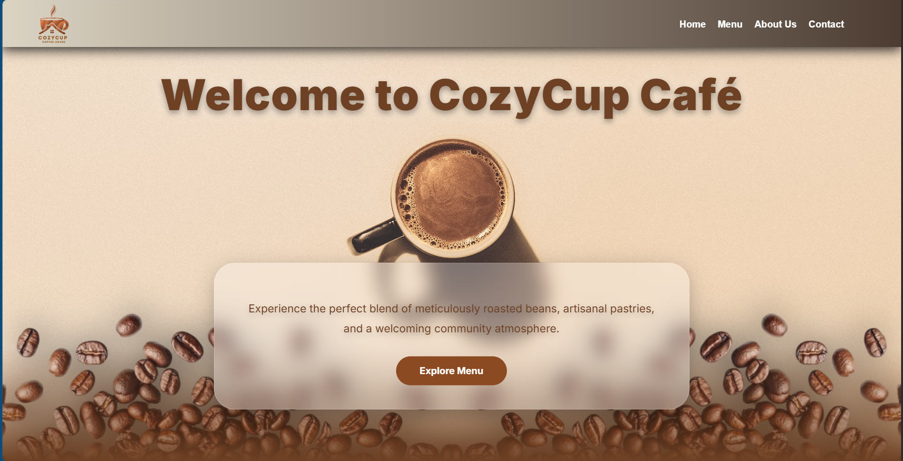
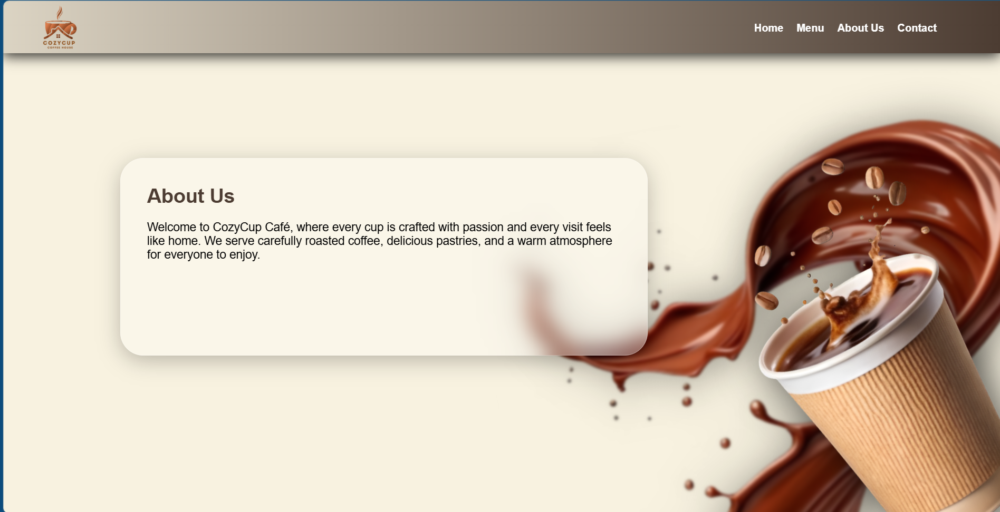
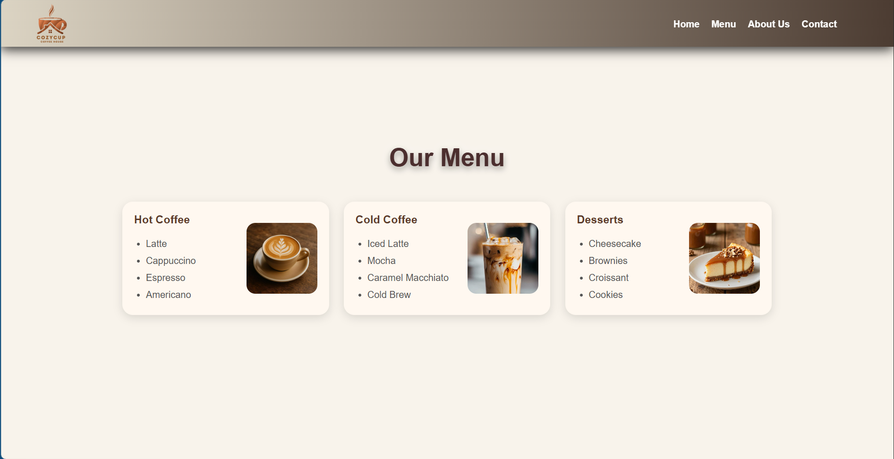
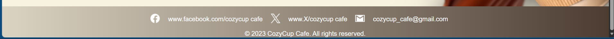

# CozyCup Café

## Project Description

CozyCup Café is a café website designed to showcase the café's menu, atmosphere, and information. The website provides visitors with a simple and welcoming experience while exploring the café.

## Features

- Responsive café website design
- Modern and attractive user interface
- Home/landing section
- About Us section
- Café menu section
- Navigation bar
- Coffee-themed visual design
- Smooth scrolling navigation

## Screen Captures

### Home Section

The home section welcomes visitors with a coffee-themed design and introduces CozyCup Café.

### About Section

The About section provides information about CozyCup Café and its concept.

### Menu Section

The menu section showcases the café's coffee and food selections.

### Contact Section

The contact section provides information for visitors who want to connect with the café.

## About the Authors

**Name:** Dariel Jean Delos Santos / Reynald Alapad

**Email:** darieljeandelossantos@gmail.com

